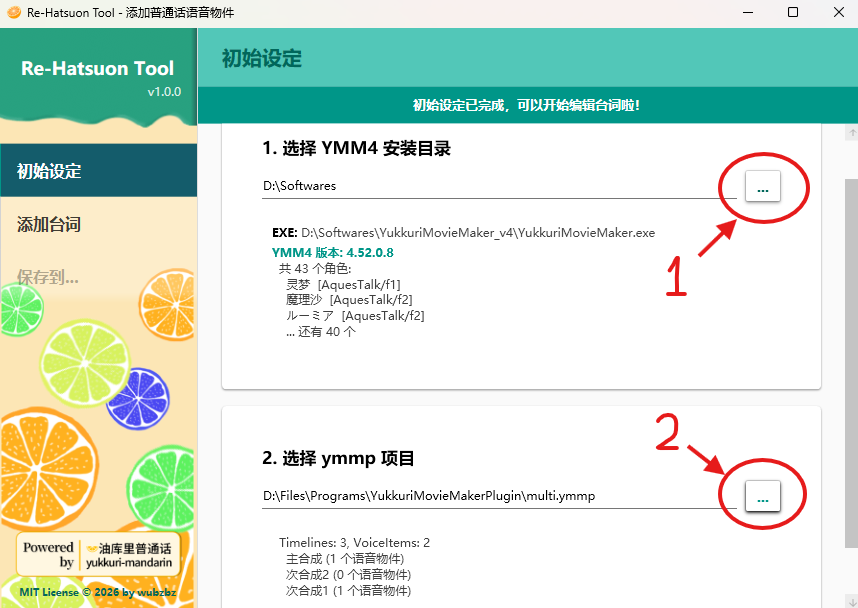
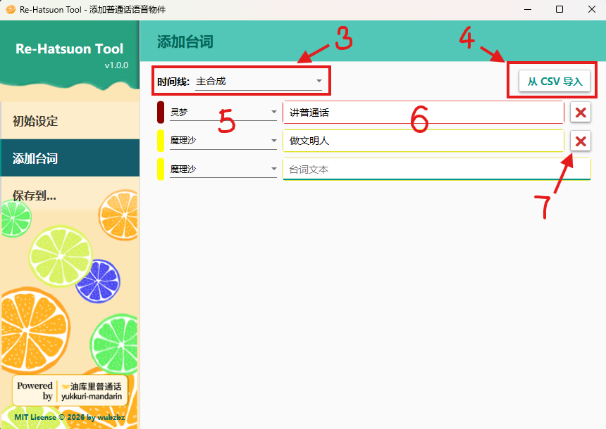
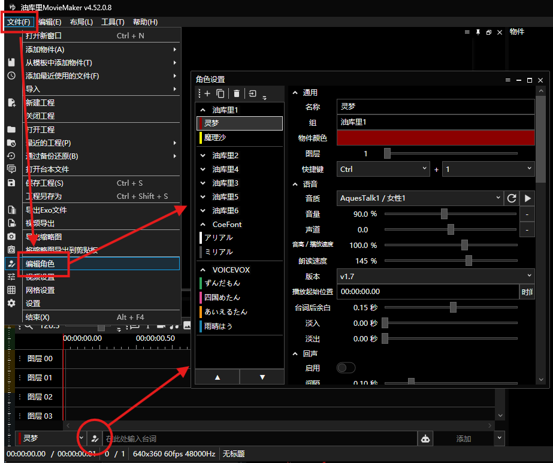
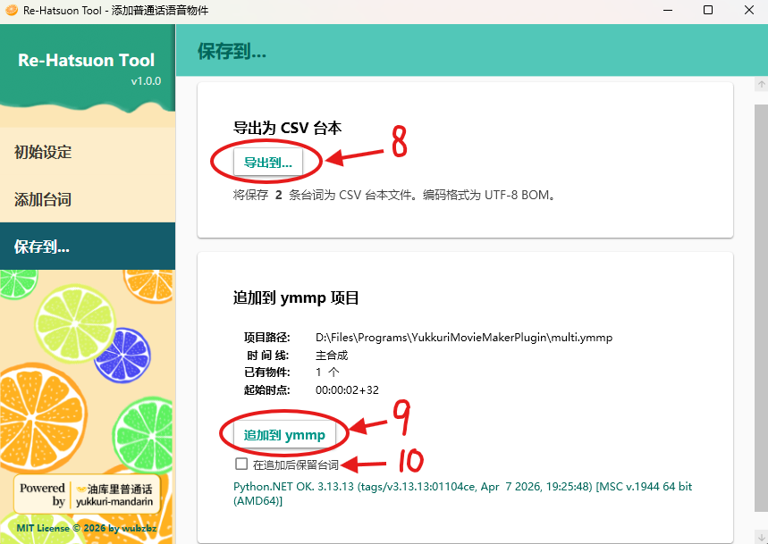
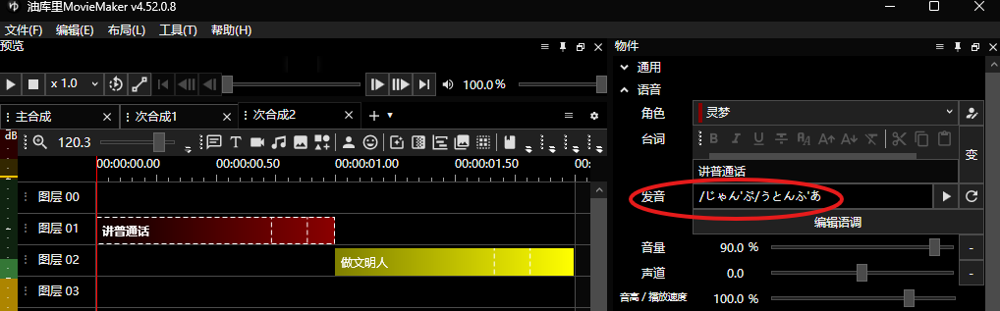

# Re-Hatsuon Tool

为 [YukkuriMovieMaker4](https://manjubox.net/ymm4/) 添加普通话发音语音物件（Voice Item）的桌面工具。

通过 [python.NET](https://github.com/pythonnet/pythonnet) 嵌入 Python 运行时，调用 [yukkuri-mandarin](https://github.com/wubzbz/yukkuri-mandarin) 将中文台词转换为含有音声记号的假名发音，批量追加到 YMM4 项目中。

## 系统要求

- Windows 10 / 11 (x64)

- [YukkuriMovieMaker4](https://manjubox.net/ymm4/) 本体

	- 需要至少运行过一次以生成配置文件，工具才能正确检测安装目录和版本。

> Python 运行时随 Release 包分发，无需单独安装。

## 下载

> [!NOTE]
> 完整版和轻量版的区别：完整版下载就能用，但是体积较大；轻量版体积小，但需要安装.NET 8.0桌面运行时。两者功能完全相同。

### 完整版

前往 [Releases](https://github.com/wubzbz/ReHatsuonTool/releases) 下载最新 `ReHatsuonTool-vX.X.X-win-x64.zip`，解压后运行 `ReHatsuonTool.exe`。

### 轻量版

首先确认你电脑上已经安装了 .NET 8.0 Desktop Runtime。如果没有，请在这里下载：

- [.NET 8.0 Desktop Runtime](https://dotnet.microsoft.com/zh-cn/download/dotnet/thank-you/runtime-desktop-8.0.27-windows-x64-installer)

然后，前往 [Releases](https://github.com/wubzbz/ReHatsuonTool/releases) 下载最新 `ReHatsuonTool-vX.X.X-win-x64-lite.zip`，解压后运行 `ReHatsuonTool.exe`。

> [!NOTE]
> 为什么会有“开发者未知”的安全提示？<br>
> 因为这个工具是我个人开发的，尚未进行代码签名认证，所以 Windows 可能会显示安全警告。请放心，这个工具是安全的（代码开源，使用Github Actions构建并发布），你可以选择“仍要运行”来使用它。

## 使用流程



1. **初始设定** — 分别选择 YMM4 安装目录（上图序号1）和要编辑的 `.ymmp` 项目文件（上图序号2）。 工具会自动检测 YMM4 版本和项目中已有的角色列表，供后续添加台词时选择。



2. **添加台词** — 选择目标时间线[^1]（上图序号3），逐行输入角色和台词；或从 CSV 文件批量导入（上图序号4）。 CSV 文件应包含两列：角色名称和台词文本，支持 UTF-8、Shift-JIS、GBK 编码（工具会自动识别）。 导入后可在表格中预览和编辑台词。

3. **编辑台词** - 在表格中编辑角色（上图序号5）和台词文本（上图序号6），角色来自 YMM4 中的“角色设置”（下图）。如果无法选择角色，请先在 YMM4 中添加至少一个角色并保存项目。点击台词文本单元格右侧的“❌”按钮（上图序号7），可以删除该行。





4. **保存到** — 导出为 CSV (上图序号8)，或将台词追加到 ymmp 项目（上图序号9）（自动追加到当前时间线的末尾）。为防止重复添加，已添加的台词会被清除。如果需要在追加后继续编辑台词，请勾选“在追加后保留台词”（上图序号10）；或者先保存为 CSV，再从 CSV 导入进行编辑。

[^1]: 所谓时间线（Timeline）就是 YMM4 中的“主合成”与“次合成”。也类似于Premiere等视频编辑软件中的序列（Sequence）。工具会自动检测项目中已有的时间线供选择。



5. **完成** — 打开 YMM4 项目，检查新添加的台词物件是否正确生成。如果需要修改或删除已添加的台词，请在 YMM4 中直接编辑或删除对应的语音物件。

## 更新和卸载

- 更新：下载新版本覆盖旧文件。

- 卸载：删除 `ReHatsuonTool` 文件夹即可。

## 开发构建

### 1. 准备 Python 运行时和依赖包

前往 [Python 官方网站](https://www.python.org/downloads/windows/) 下载 Python 3.13 嵌入版（Windows x86-64 embeddable zip file），解压到 `ReHatsuonTool/python` 目录下。 然后安装 pip 和必要的 Python 包。

```bash
cd ReHatsuonTool/python

# 安装 pip
.\python.exe -c "import urllib.request; urllib.request.urlretrieve('https://bootstrap.pypa.io/get-pip.py', 'get-pip.py')"
.\python.exe get-pip.py --no-warn-script-location

# 修改 .pth 文件，启用 site 模块以支持第三方包
(Get-Content $pthFile) -replace '#import site', 'import site' | Set-Content $pthFile

# 安装 yukkuri-mandarin 和依赖包
.\python.exe -m pip install setuptools wheel
.\python.exe -m pip install yukkuri-mandarin[jieba]
```

### 2. 构建

```bash
dotnet build ReHatsuonTool/ReHatsuonTool.csproj -c Release
```

## 许可证

MIT License © 2026 wubzbz
